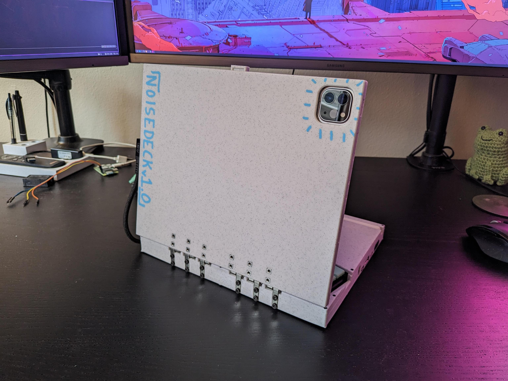

# noisedeck

a cyberdeck for dealing in noise

## features
- btrfld keyboard
- trackpad
- headphone jack
- mic jack
- 1x usb c ports
- 2x usb a ports
- ipad
- ipad pencil + charging space
  - use https://www.amazon.com/Paiholy-Compatible-Generation-Lightweight-Convenient/dp/B0BMB7362T in the deck
- rpi zero 2 w + 5000mah battery

future:
- extra keys in topcase for common hotkeys(?)
- choc key one octave keyboard in topcase(?)
- pitch joystick/wheel that snaps back to the center

the rpi zero 2 w is ran so its usb is in gadget mode, so it tells the ipad it is an ethernet device.
so you can setup a local network and ssh directly from the ipad to the rpi without using wifi
this leaves the wifi chipset useful for other things

## Size constraints

btrfld:
- 129mm deep
- 215mm wide

## parts
hinges:
https://www.amazon.com/gp/product/B0BFWNJMCY/

hinge fasteners:
M3x8 countersunk fasteners: https://www.amazon.com/HanTof-Countersunk-Machine-Wrenches-Threaded/dp/B0B9HWVV61
M3x10 countersunk fasteners
M3 threaded, DIN 562 flat square nuts: https://www.amazon.com/M3nS-Printers-Stainless-Conform-Quantity/dp/B0BD2N9KTV

power switches:
https://www.amazon.com/dp/B075RC6TFB

apple pencil charging cradle:
https://www.amazon.com/Paiholy-Compatible-Generation-Lightweight-Convenient/dp/B0BMB7362T

midcase fasteners (plastic to plastic):
m2x5 and m2x6 tapered flat head self taping screws

cheap ipad magnetic folio case

btrfld keyboard: https://github.com/SolidHal/btrfld

usbc to 3x usbc (2 data, one power): https://www.amazon.com/gp/product/B09PFR2J82

usbc to 4x usbA : https://www.amazon.com/dp/B09N36LZSQ

usbA dac: https://www.amazon.com/dp/B01DLY3IW8

usbc right angle extension: https://www.amazon.com/dp/B0B71BZ4YF

rpi zero 2 w

5000mah battery

pcb usb hub https://www.amazon.com/dp/B09FX4QN4J

used to get a power only usbc port for charging the rpi battery: https://www.amazon.com/dp/B07VBV1PY5

## Notes

dac must have a power switch, otherwise the ipad will always use it by default and never allow usage of the speakers

TODO:

- holes in midcase/topcase and lid for latch(?)

- extra keys in topcase for common hotkeys(?)
- choc key one octave keyboard in topcase(?)

## Assembly notes

case:
- use 52 gauge drill bit to clean out midcase holes for the m2 screws
- use 46 gauge drill bit to clean out topcase holes for the m2 screws
- use chamfer bit on bottomcase holes screws sit flush
- glue eyeglass nosepads to bottomcase for feet
- hinges need to be filed/ground shorter on the side that would otherwise stick out through the bottom case
- cleaning out the hinge holes in the ipad enclosure is annoying. Recommend using a 46 gauge drill bit
- tear down the ipad folio case to just the parts required to hold the magnets in place. lets call this the "case core"
  - attach a thin film to the side of the case core that magnetizes to the ipad
  - superglue the case core into the ipad enclosure so that the ipad is held into the ipad enclosure magnetically

- the 5000mah battery pack fits nicely under the dac.

wiring:

The wiring is a bit messy, but it works and all fits with plenty of space:

ipad -> extension -> usbc/usbc 3 way splitter -> one usbc charging port, one usbc data port, and the usbc to usbA splitter

usbA splitter:
- port 1:
  - data and ground to headphone port dac
  - power to two switches on the left side of the noisedeck. One switch to the dac, other to pencil charger. Only use one of these at a time.
- port 2:
  - data only to rpi zero 2w data port. Power to nowhere
- port 3:
  - to pcb usb hub:
    - port 3a:
      - to btrfld
    - port 3b:
      - to trackpad
- port 4:
  - glued into the left side of the noisedeck, externally accessible usbA port

